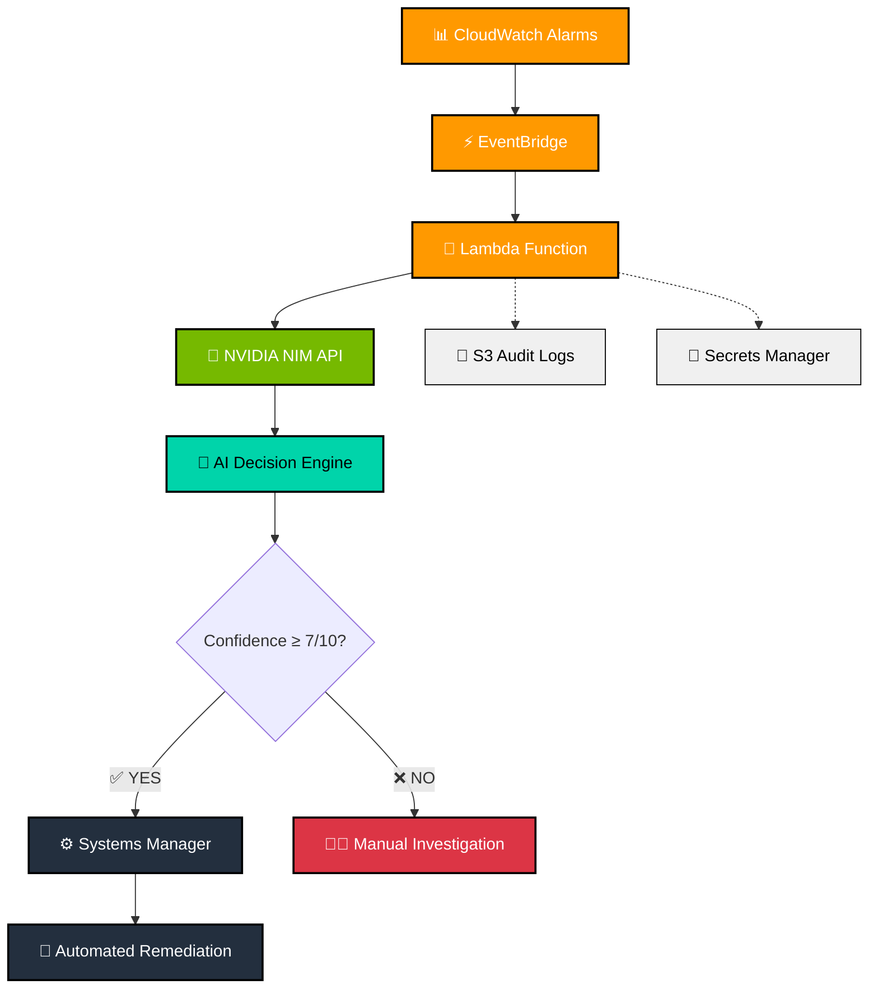

# GitHub Architecture Diagram

## Replace the existing mermaid diagram in README.md with this:

```mermaid
graph TB
    A[📊 CloudWatch Alarms] --> B[⚡ EventBridge]
    B --> C[🔧 Lambda Function]
    C --> D[🧠 NVIDIA NIM API]
    D --> E[🎯 AI Decision Engine]
    E --> F{Confidence ≥ 7/10?}
    F -->|✅ YES| G[⚙️ Systems Manager]
    F -->|❌ NO| H[👨‍💻 Manual Investigation]
    G --> I[🚀 Automated Remediation]
    C -.-> J[📝 S3 Audit Logs]
    C -.-> K[🔐 Secrets Manager]
    
    style A fill:#ff9900,stroke:#000,stroke-width:2px,color:#fff
    style B fill:#ff9900,stroke:#000,stroke-width:2px,color:#fff
    style C fill:#ff9900,stroke:#000,stroke-width:2px,color:#fff
    style D fill:#76b900,stroke:#000,stroke-width:2px,color:#fff
    style E fill:#00d4aa,stroke:#000,stroke-width:2px,color:#000
    style G fill:#232f3e,stroke:#000,stroke-width:2px,color:#fff
    style I fill:#232f3e,stroke:#000,stroke-width:2px,color:#fff
    style H fill:#dc3545,stroke:#000,stroke-width:2px,color:#fff
    style J fill:#f0f0f0,stroke:#000,stroke-width:1px,color:#000
    style K fill:#f0f0f0,stroke:#000,stroke-width:1px,color:#000
```

## Alternative Simple Version (if above doesn't work):

```mermaid
graph TD
    CW[CloudWatch Alarms] --> EB[EventBridge]
    EB --> LF[Lambda Function]
    LF --> NIM[NVIDIA NIM]
    NIM --> AI[AI Decision Engine]
    AI --> DEC{Confidence >= 7?}
    DEC -->|Yes| SM[Systems Manager]
    DEC -->|No| MAN[Manual Investigation]
    SM --> REM[Auto Remediation]
    LF --> S3[S3 Audit Logs]
    LF --> SEC[Secrets Manager]
    
    style LF fill:#ff9900
    style NIM fill:#76b900
    style AI fill:#00d4aa
    style SM fill:#232f3e
```