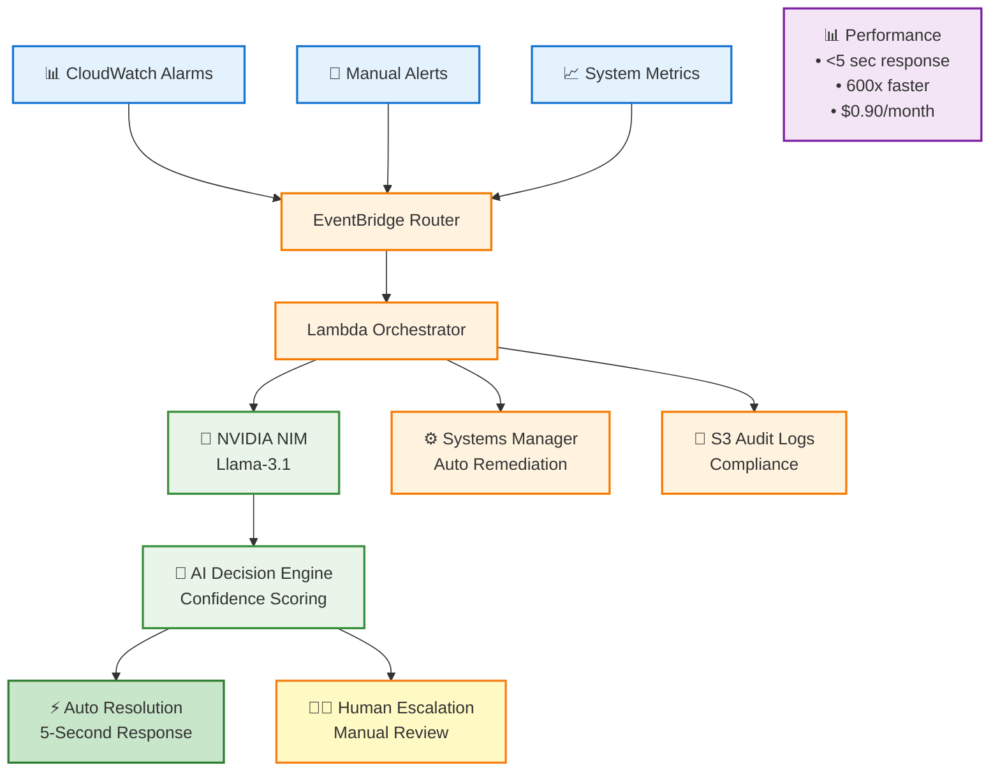
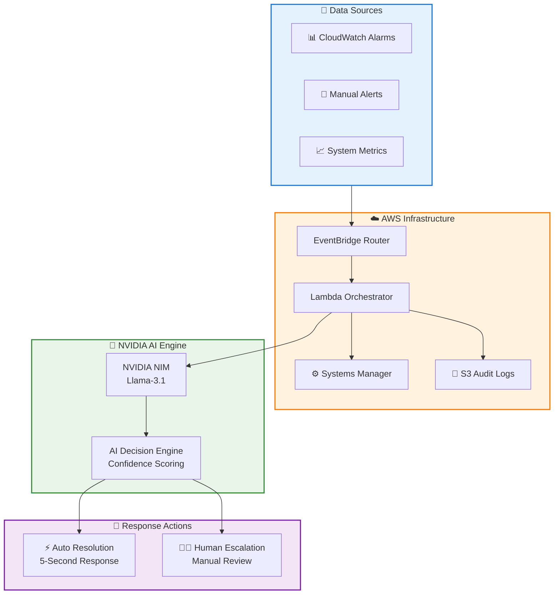

# Improved Architecture Diagram

```mermaid
flowchart TD
    A[📊 CloudWatch Alarms] --> D[EventBridge Router]
    B[🚨 Manual Alerts] --> D
    C[📈 System Metrics] --> D
    
    D --> E[Lambda Orchestrator]
    
    E --> F[🧠 NVIDIA NIM<br/>Llama-3.1]
    E --> G[⚙️ Systems Manager<br/>Auto Remediation]
    E --> H[📝 S3 Audit Logs<br/>Compliance]
    
    F --> I[🎯 AI Decision Engine<br/>Confidence Scoring]
    
    I --> J[⚡ Auto Resolution<br/>5-Second Response]
    I --> K[👨‍💻 Human Escalation<br/>Manual Review]
    
    %% Performance box
    L[📊 Performance<br/>• <5 sec response<br/>• 600x faster<br/>• $0.90/month]
    
    style A fill:#E3F2FD,stroke:#1976D2,stroke-width:2px
    style B fill:#E3F2FD,stroke:#1976D2,stroke-width:2px
    style C fill:#E3F2FD,stroke:#1976D2,stroke-width:2px
    style D fill:#FFF3E0,stroke:#F57C00,stroke-width:2px
    style E fill:#FFF3E0,stroke:#F57C00,stroke-width:2px
    style G fill:#FFF3E0,stroke:#F57C00,stroke-width:2px
    style H fill:#FFF3E0,stroke:#F57C00,stroke-width:2px
    style F fill:#E8F5E8,stroke:#388E3C,stroke-width:2px
    style I fill:#E8F5E8,stroke:#388E3C,stroke-width:2px
    style J fill:#C8E6C9,stroke:#2E7D32,stroke-width:2px
    style K fill:#FFF9C4,stroke:#F57F17,stroke-width:2px
    style L fill:#F3E5F5,stroke:#7B1FA2,stroke-width:2px
```

## Alternative with Grouped Sections:

```mermaid
flowchart TD
    subgraph Sources ["📡 Data Sources"]
        A[📊 CloudWatch Alarms]
        B[🚨 Manual Alerts]
        C[📈 System Metrics]
    end
    
    subgraph AWS ["☁️ AWS Infrastructure"]
        D[EventBridge Router]
        E[Lambda Orchestrator]
        G[⚙️ Systems Manager]
        H[📝 S3 Audit Logs]
    end
    
    subgraph AI ["🧠 NVIDIA AI Engine"]
        F[NVIDIA NIM<br/>Llama-3.1]
        I[AI Decision Engine<br/>Confidence Scoring]
    end
    
    subgraph Actions ["🎯 Response Actions"]
        J[⚡ Auto Resolution<br/>5-Second Response]
        K[👨‍💻 Human Escalation<br/>Manual Review]
    end
    
    Sources --> D
    D --> E
    E --> F
    E --> G
    E --> H
    F --> I
    I --> J
    I --> K
    
    style Sources fill:#E3F2FD,stroke:#1976D2,stroke-width:2px
    style AWS fill:#FFF3E0,stroke:#F57C00,stroke-width:2px
    style AI fill:#E8F5E8,stroke:#388E3C,stroke-width:2px
    style Actions fill:#F3E5F5,stroke:#7B1FA2,stroke-width:2px
```