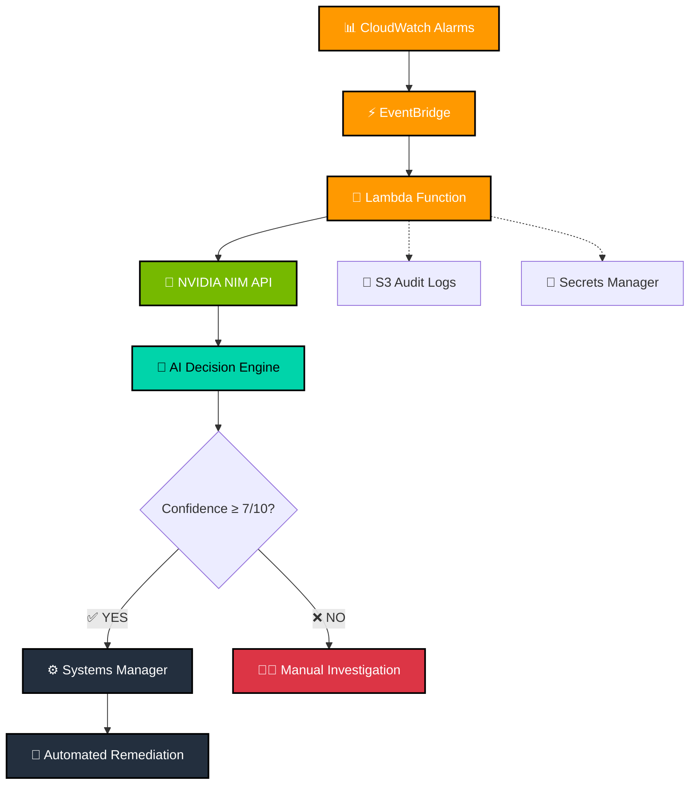

# IntelliNemo Agent Architecture

```mermaid
flowchart TD
    A["📊 CloudWatch Alarms"] --> B["⚡ EventBridge"]
    B --> C["🔧 Lambda Function"]
    C --> D["🧠 NVIDIA NIM API"]
    D --> E["🎯 AI Decision Engine"]
    E --> F{"Confidence ≥ 7/10?"}
    F -->|"✅ YES"| G["⚙️ Systems Manager"]
    F -->|"❌ NO"| H["👨‍💻 Manual Investigation"]
    G --> I["🚀 Automated Remediation"]
    C -.-> J["📝 S3 Audit Logs"]
    C -.-> K["🔐 Secrets Manager"]
    
    classDef aws fill:#ff9900,stroke:#000,stroke-width:2px,color:#fff
    classDef nvidia fill:#76b900,stroke:#000,stroke-width:2px,color:#fff
    classDef ai fill:#00d4aa,stroke:#000,stroke-width:2px,color:#000
    classDef auto fill:#232f3e,stroke:#000,stroke-width:2px,color:#fff
    classDef manual fill:#dc3545,stroke:#000,stroke-width:2px,color:#fff
    
    class A,B,C aws
    class D nvidia
    class E ai
    class G,I auto
    class H manual
```

**Convert to image using:**
- GitHub (renders automatically)
- Mermaid Live Editor: https://mermaid.live/
- VS Code Mermaid extension
- Online converters