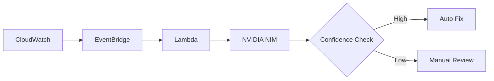
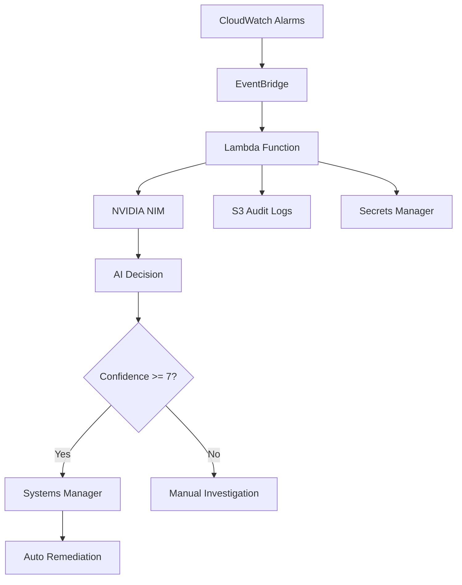

# Simple Working Mermaid Diagram

## Option 1: Basic Flow


## Option 2: Detailed Flow


## Alternative: Use Draw.io Template

**Quick Steps:**
1. Go to https://app.diagrams.net/
2. Choose "AWS Architecture" template
3. Drag these components:
   - CloudWatch (Monitoring)
   - Lambda (Compute)
   - EventBridge (Integration)
   - S3 (Storage)
   - Add NVIDIA NIM as custom box
4. Connect with arrows
5. Export as PNG

## Or Use This ASCII (Screenshot it):
```
┌─────────────┐    ┌─────────────┐    ┌─────────────┐    ┌─────────────┐
│ CloudWatch  │───▶│ EventBridge │───▶│   Lambda    │───▶│ NVIDIA NIM  │
│   Alarms    │    │   Router    │    │Orchestrator │    │ Llama-3.1   │
└─────────────┘    └─────────────┘    └─────────────┘    └─────────────┘
                                              │                    │
                                              ▼                    ▼
                                      ┌─────────────────────────────────┐
                                      │      AI Decision Engine         │
                                      │     Confidence Scoring          │
                                      └──────────────┬──────────────────┘
                                                     │
                                                     ▼
                                              ┌─────────────┐
                                              │Confidence   │
                                              │  >= 7/10?   │
                                              └──────┬──────┘
                                                     │
                                            ┌────────┴────────┐
                                            ▼                 ▼
                                    ┌─────────────┐   ┌─────────────┐
                                    │  Systems    │   │   Manual    │
                                    │  Manager    │   │Investigation│
                                    │ Auto-Fix    │   │   Review    │
                                    └─────────────┘   └─────────────┘
```